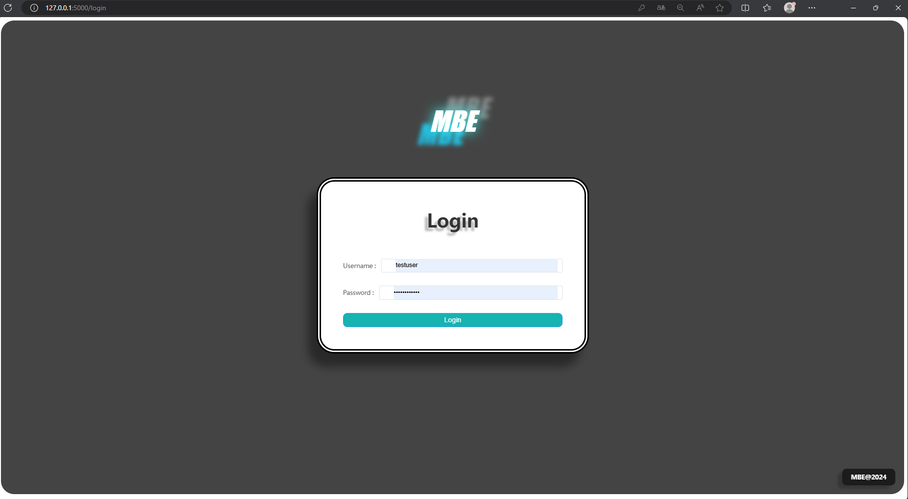
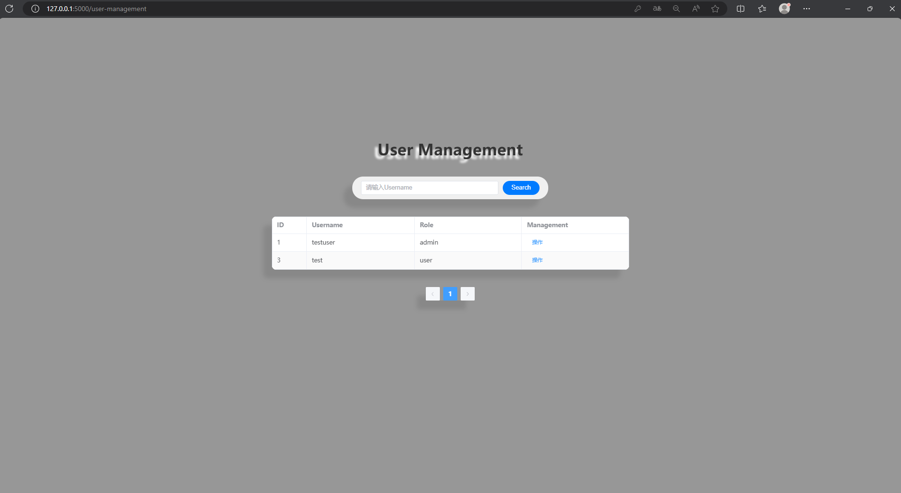
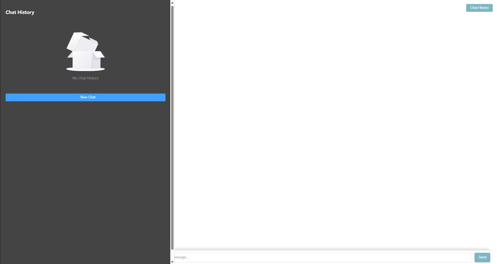
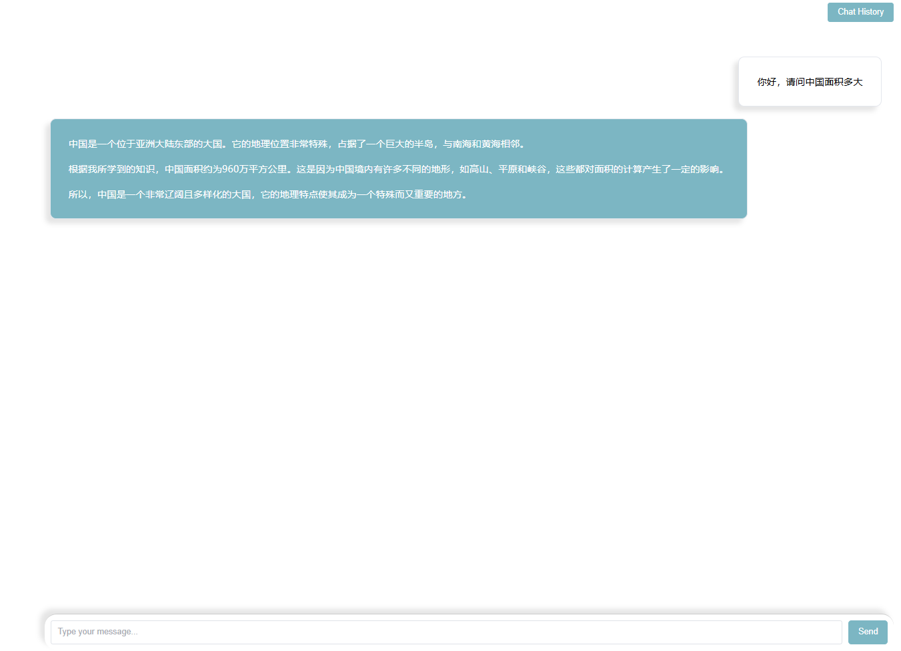
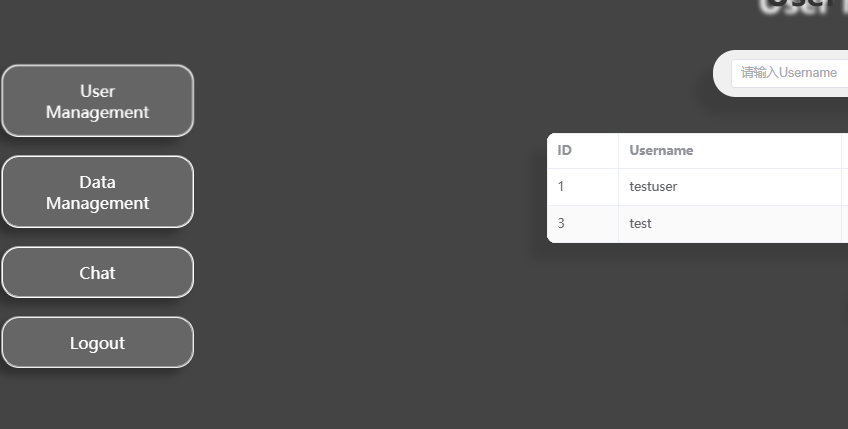

# MBE
Mechanical Brain Engine -MBE开发中。

使用技术栈：Flask,LangChain,Vue,postgreSQL。

开发日志：
            #01 构建完成登录以及数据管理功能。

            #02 加入模型对话功能，增加管理员权限，增加账户权限资料管理，数据库从SQLITE迁移至PostgreSQL。

            #03 更新部分ui，添加动效，重新构建rag系统。

更新ui界面：

